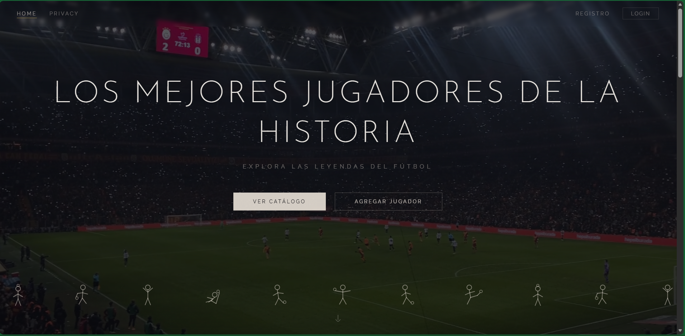
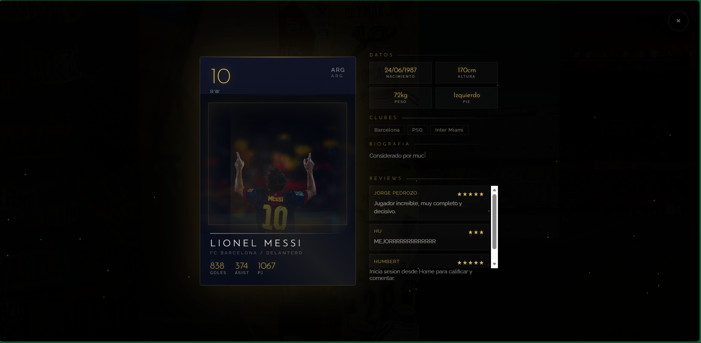
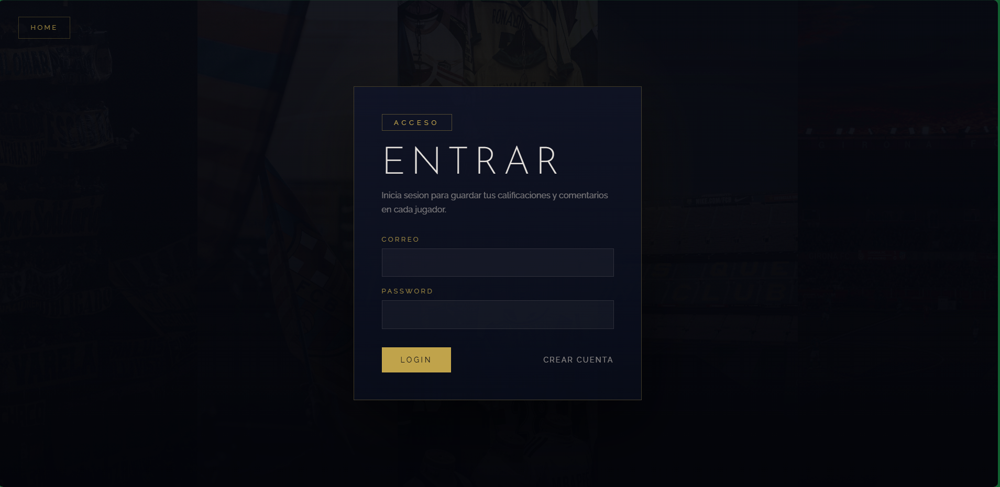
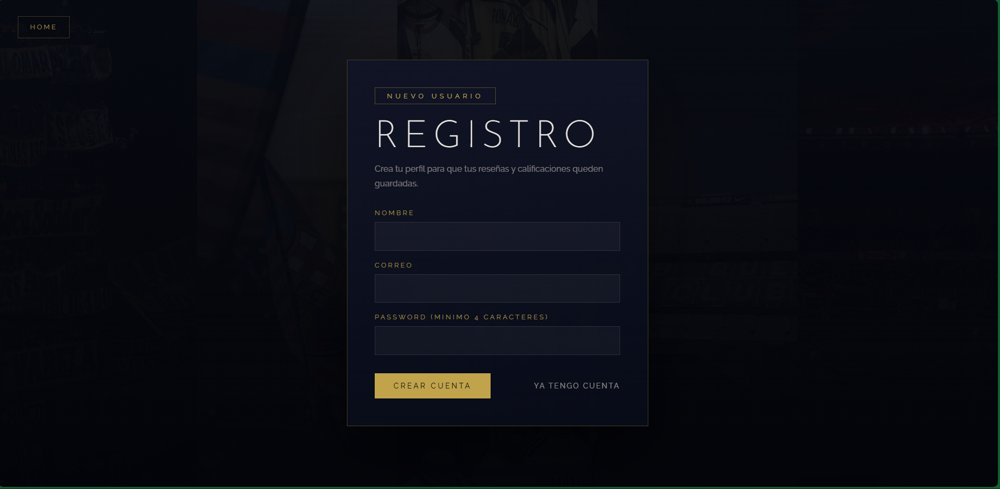

# CatalogoMulticapa

Aplicacion web de catalogo de futbol profesional desarrollada con **ASP.NET Core MVC (.NET 10)** y **Clean Architecture**. Permite explorar, gestionar y calificar a los mejores jugadores de la historia del futbol a traves de una interfaz interactiva con carrusel 3D, sistema de reviews y autenticacion de usuarios.

---

## Capturas de Pantalla

### Pagina Principal


### Catalogo de Jugadores


### Detalle del Jugador


### Inicio de Sesion


### Registro de Usuario


---

## Arquitectura

El proyecto sigue el patron de **Clean Architecture** dividido en 4 capas:

```
CatalogoMulticapa/
├── CatalogoApp.Domain/            # Entidades y contratos (interfaces)
├── CatalogoApp.Aplication/        # Logica de negocio y servicios
├── CatalogoApp.Infrastructure/    # Acceso a datos (repositorios JSON)
└── CatalogoApp.Presentation/     # Controladores, vistas Razor y assets
```

| Capa | Responsabilidad |
|------|----------------|
| **Domain** | Modelos (`Item`, `User`, `Review`), interfaces de repositorio, validaciones |
| **Application** | Servicios (`ItemService`, `UserService`, `ReviewService`), hashing de contrasenas |
| **Infrastructure** | Repositorios JSON con persistencia en archivos, thread safety con `lock()` |
| **Presentation** | Controladores MVC, vistas Razor, archivos estaticos, configuracion del servidor |

---

## Funcionalidades

- **Carrusel 3D interactivo** con navegacion por teclado, botones y swipe tactil
- **CRUD completo** de jugadores (agregar, editar, eliminar)
- **Sistema de reviews** con calificacion por estrellas y comentarios
- **Autenticacion de usuarios** con registro e inicio de sesion
- **Hashing de contrasenas** con PBKDF2-SHA256 y migracion transparente de contrasenas legacy
- **Busqueda y filtros** por nombre, equipo, pais y posicion
- **Proteccion CSRF** global con `AutoValidateAntiforgeryToken`
- **Sesiones seguras** con cookies HttpOnly y SameSite Strict
- **Thread safety** en repositorios JSON para acceso concurrente
- **Responsive design** adaptado a escritorio, tablet y movil

---

## Stack Tecnologico

| Componente | Tecnologia |
|-----------|-----------|
| Framework | ASP.NET Core MVC (.NET 10) |
| Vistas | Razor Views (`.cshtml`) |
| Almacenamiento | Archivos JSON (`items.json`, `users.json`, `reviews.json`) |
| Seguridad | PBKDF2-SHA256, CSRF, HttpOnly Cookies |
| Frontend | HTML5, CSS3 (custom), JavaScript vanilla |
| Tipografia | Josefin Sans, Raleway, Oswald, Bebas Neue, Barlow |
| Tema visual | Dark theme (#060810) con acentos dorados (#d4b450) |

---

## Requisitos

- [.NET 10 SDK](https://dotnet.microsoft.com/download/dotnet/10.0)
- Visual Studio 2022+ o VS Code

## Instalacion y Ejecucion

```bash
# Clonar el repositorio
git clone https://github.com/hum55/CatalogoMulticapa.git
cd CatalogoMulticapa

# Ejecutar la aplicacion
dotnet run --project CatalogoApp.Presentation --launch-profile http
```

La aplicacion estara disponible en `http://localhost:5005`.

---

## Estructura de Datos

Los datos se almacenan en archivos JSON ubicados en `CatalogoApp.Presentation/data/`:

- **`items.json`** — Jugadores con estadisticas, fotos y datos personales
- **`users.json`** — Usuarios registrados con roles y control de acceso
- **`reviews.json`** — Calificaciones y comentarios por jugador

---

## Uso de Inteligencia Artificial

Este proyecto fue desarrollado con asistencia de herramientas de inteligencia artificial.

---

## Autor

**Humberto Ramirez Gruintal**

---

## Licencia

Este proyecto es de uso academico.
